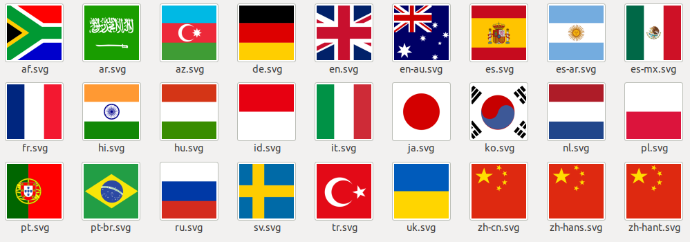

# Django Translation Flags

[](https://travis-ci.org/silviolleite/django-translation-flags)
[](https://codeclimate.com/github/silviolleite/django-translation-flags/maintainability)
[](https://codecov.io/gh/silviolleite/django-translation-flags) 
[](https://pypi.org/project/django-pwa/)
[](https://pypi.org/project/django-translation-flags)

This Django app provides integration for translation options in templates with some most common standard world languages. This is useful fow when you need to display language options in yours Django Apps. 


Requirements
=====
Django Translation Flags require Django Internationalization and localization properly configured. You can see more about theses settings in [https://docs.djangoproject.com/en/2.1/topics/i18n/](https://docs.djangoproject.com/en/2.1/topics/i18n/)

Basically you need to:
 
1. Define a custom `LANGUAGES` list on `settings.py` with tuples, i.e:

```python
from django.utils.translation import gettext_lazy as _

LANGUAGES = [
  ('de', _('German')),
  ('en', _('English')),
  ('pt-br', _('Brazilian Portuguese'))
]
```
Only languages listed in the `LANGUAGES` setting can be selected.
This example restricts languages that are available for automatic selection to German, English and Brazilian Portuguese

2. Markup the text to translation:

The format of `.po` files is straightforward. Each `.po` file contains a small bit of metadata, such as the translation maintainer’s contact information, but the bulk of the file is a list of messages – simple mappings between translation strings and the actual translated text for the particular language.

For instance, if your Django app contained a translation string for the text "Welcome to my site.", like so:

```python
from django.utils.translation import gettext_lazy as _
_("Welcome to my site.")

```
...then `django-admin makemessages` will have created a `.po` file containing the following snippet – a message:

```text
#: path/to/python/module.py:23
msgid "Welcome to my site."
msgstr ""

```

3. Generate and compile it using the commands bellow:

- The first step is to create a message file for a new language:
```bash
django-admin makemessages -l de -l en -l pt_BR
```
- Compiling message files after creating your message file:

```bash
django-admin compilemessages
```

For more detailed information on how to create language files it is suggested to read the documentation: [https://docs.djangoproject.com/en/2.1/topics/i18n/translation/#how-to-create-language-files](https://docs.djangoproject.com/en/2.1/topics/i18n/translation/#how-to-create-language-files)

Install
=====
Install from PyPI:

```
pip install django-translation-flags
```

Configuration
=====
Add `django-translation-flags` to your list of `INSTALLED_APPS` in settings.py:

```python
INSTALLED_APPS = [
    ...
    'django-translation-flags',
    ...
]
```
Add the Django Translation Flags URLs to `urls.py`:
```python
from django.conf.urls import url, include

urlpatterns = [
    ...
    path('i18n/', include('django-translation-flags.urls')),
    ...
]
```

Inject the required meta tags in your `base.html` (or wherever your HTML &lt;head&gt; is defined):
```html


<head>
    <ul>
        
    </ul>
</head>
```
By default it will show the rectangular icons, but you can change it to `square`:
```html


<head>
    <ul>
        
    </ul>
</head>
```

Optionally you can set your custom class for HTML tags: 
```html


<head>
    <ul>
        
    </ul>
</head>
```

The `languages` template tags accept `**kwargs` to configure the HTML elements.

The HTML structure is:

```html
<li>
    <a>
        <span></span>
    </a>
</li>
```

So you can set the classes to these HTML tags:

**li_class**: Class to `li` tag (Default: empty)

**a_class**: Class to `a` tag (Default: empty)


How does it work?
=====
The Django Translation Flags has a `CSS` file where all the most important languages flags are configured. The avaliable flags are:

`af`: Afrikaans, `ar`: Arabic, `az`: Azerbaijani, `de`: German, `en`: English, `en-au`: Australian English, `es`: Spanish, `es-ar`: Argentinian Spanish, `es-mx`: Mexican Spanish, `fr`: French, `hi`: Hindi, `hu`: Hungarian, `id`: Indonesian, `it`: Italian, `ja`: Japanese, `ko`: Korean, `nl`: Dutch (Nederlands), `pl`: Polish, `pt`: Portuguese, `pt-br`: Brazilian Portuguese, `ru`: Russian, `sv`: Swedish, `tr`: Turkish, `uk`: Ukrainian, `zh-cn`: Simplified Chinese, `zh-hans`: Simplified Chinese and `zh-hant`: Traditional Chinese.



The App get the language code from `LANGUAGES` on `settings.py` and then it makes the magic happen.

Feedback
=====
Feedback and pull requests are strongly encouraged and kindly appreciated (-:

Contributing
=====

#### Python

1. Clone the repository.
2. Create a virtualenv with Python 3.6 or 3.7
3. Active the virtualenv.
4. Install the dependencies.
6. Run the tests.

```console
git clone https://github.com/silviolleite/django-translation-flags
cd django-translation-flags
python -m venv .venv
.venv/bin/activate
pip install -r requirements.txt
python runtests.py
```

#### Less to CSS

You will need of `node` and `npm` previously installed.

1. Install the dependencies
2. Run the gulp
3. Edit the less files: `/assets/less/`

```console
npm install
npm run build
```


Licensing
=====
All files in this repository are distributed under the MIT license.